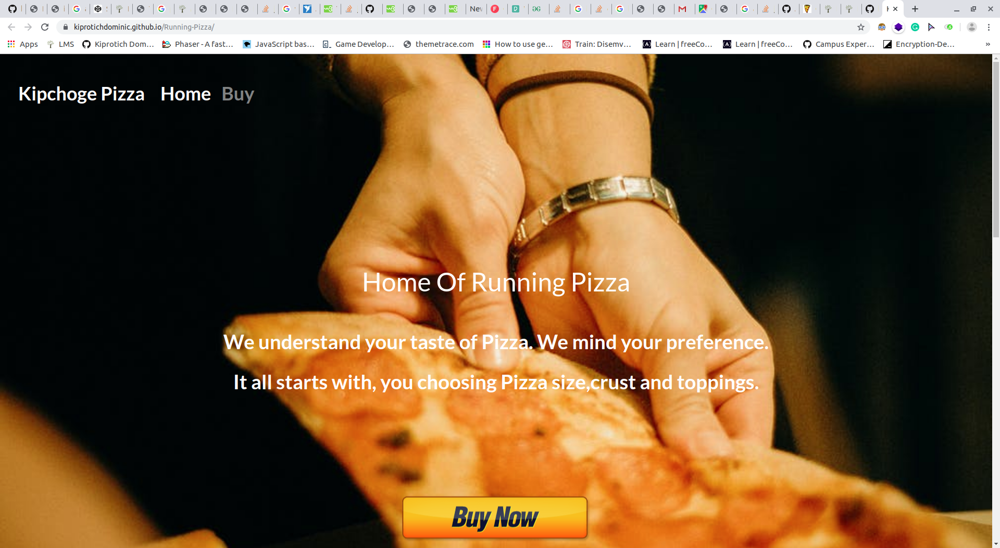

# Running Pizza

## Author

Kiprotich Dominic Korir

## Description

This a website for a pizza-delivery website called Running Pizza. Inspired by no human is limited, we believe that no one is limited on ordering pizza.
We give you a platform with unlimited possibilities.

## Setup/Installation Requirements

- Open terminal (CTRL ALT T)
- Git clone  <https://github.com/kiprotichdominic/Running-Pizza>
- cd RUNNING-PIZZA-MASTER
- On terminal type atom . to open using atom or type code . to open using Visual Studio.
- Feel free to contribute to this project.

## Behaviour Driven Development
 ### Kipchoge Pizza landing page.
 - You click the buy button and it takes you to the buying section.

## Known Bugs

My website location on google maps is not correct.

## Live link to my site

<https://kiprotichdominic.github.io/Running-Pizza/>

## Technologies Used

- HTML5
- CSS3
- Bootstrap4
- Jquery-3
- GIT version control

## Support and contact details

- kiprotichkorir36@gmail.com
- Facebook <https://www.facebook.com/iamdommie/>

## Licence

- 
